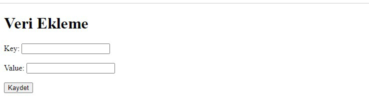
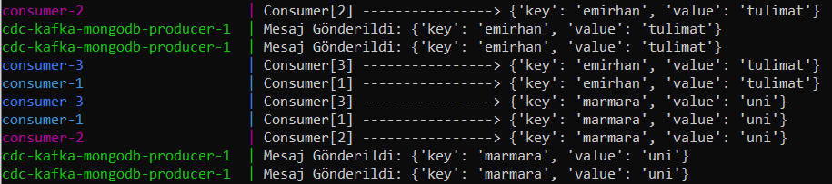
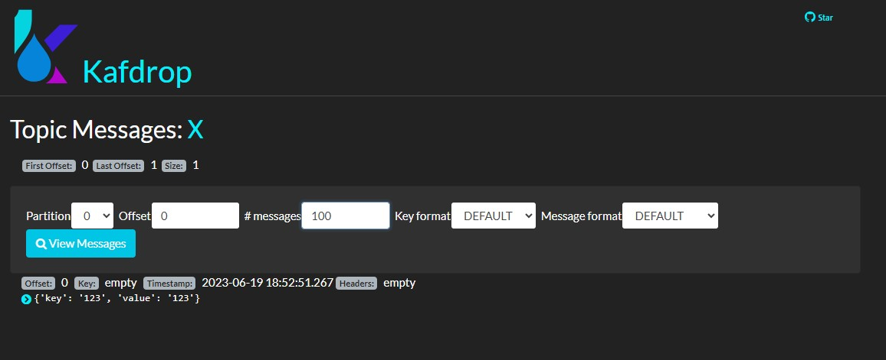
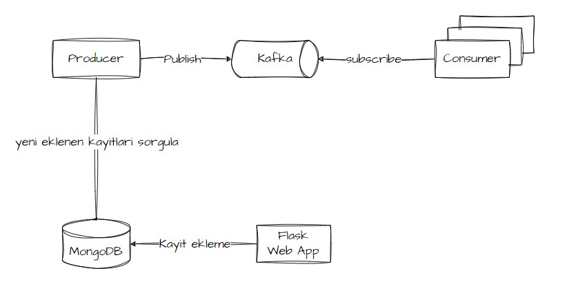

# MongoDB Değişiklik Algılama ile Kafka

Bu proje, bir Producer ve bir Consumer uygulaması geliştirir. Producer uygulama, her 10 saniyede bir belirli bir MongoDB collection yeni document için sorgular ve her yeni belge için bir JSON mesajını bir Kafka message yayınlar. Consumer uygulaması, Kafka konusundan mesajları tüketir ve onları konsola yazdırır.

## Build Adımları

1. Bu repoyu klonlayın:
```sh
git clone https://github.com/emirhantulimat/CDC-Kafka-MongoDB
```

2. Proje dizinine gidin: 
```sh
cd CDC-Kafka-MongoDB
```

3. Docker imajlarını oluşturun: 
```sh
docker-compose build
```

4. Docker hizmetlerini başlatın:
```sh
docker-compose up
```


## Uygulamaların Çalıştırılması

Docker hizmetlerini başlattıktan sonra, Producer ve Consumer uygulamaları otomatik olarak çalışmaya başlar. Üretici, her 10 saniyede bir MongoDB collection yeni document için kontrol eder ve yeni document Kafka konusuna yayınlar. Consumer, Kafka konusundan message tüketir ve onları konsola yazdırır.

mongoDB'ye veri yazmak için [localhost:5000](localhost:5000) adresini kullanmalısınız.
Kafka topiclerini incelemek için kafdrop arayüzü kullanılmıştır.  [localhost:9000](localhost:9000) adresine girerek inceleyebilirsiniz.

MongoDB ye Veri giriş arayüzü


Kafka mesajların terminal üzerinde görüntülenmesi


Kafdrop arayüzü üzerinden mesajların görüntülenmesi


## Projenin Diyagramı


## Kullanılan Teknolojiler

-   Python
-   Docker
-   Apache Kafka
-   ZooKeeper
-   Kafdrop
-   MongoDB


## Lisans

Bu proje [MIT Lisansı](LICENSE) altında lisanslanmıştır.
